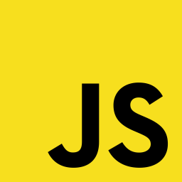

### Olá, meu nome é Renato 👋

:books: Atualmente cursando: Bacharelado de Sistemas de Informação na   
:page_facing_up: TCC: *"Bloqueio de Anúncios utilizando Filtro de DNS com Raspberry Pi"*  
:email: **_Procurando Estágio de TI_**  

#### :wrench: Linguagens e Ferramentas
       

#### :mailbox: Redes Sociais: &nbsp;&nbsp;&nbsp;&nbsp; [Twitter](https://www.twitter.com/renatocfrancisc) &nbsp;&nbsp;&nbsp;&nbsp; [Steam](https://steamcommunity.com/id/renatocf/) &nbsp;&nbsp;&nbsp;&nbsp; [LinkedIn](https://www.linkedin.com/in/renato-c-francisco-365715175/)
